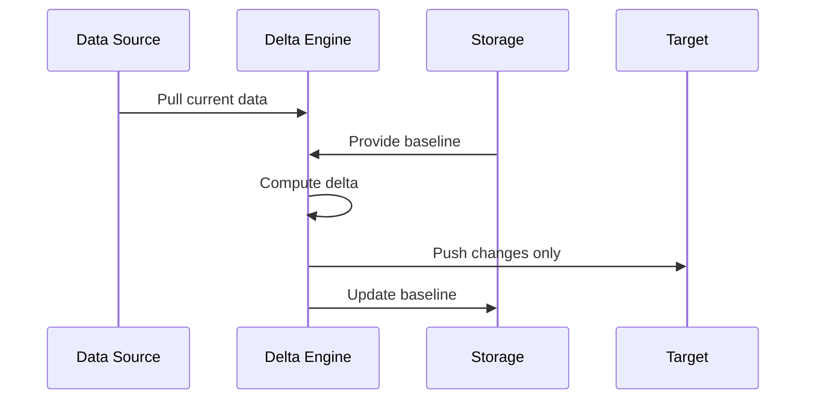
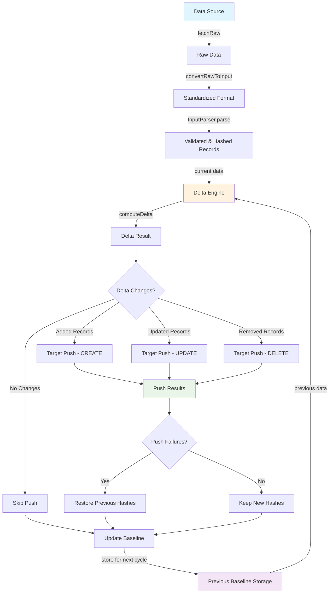

# Integration core library

A Nodejs typescript library of abstract components and interfaces that provide baseline functionality for integration operations between source and target systems.

## Overview

The integration system implements a delta-based synchronization pattern that efficiently processes only changes between data pulls. The core workflow involves pulling data from a source as a fresh baseline, computing changes against a previous baseline, and pushing only the differences to a target system.

## Hashing

The integration system relies on cryptographic hashing to efficiently detect changes between data pulls. Each record is assigned a hash value computed from its combined field values. This creates a unique "fingerprint" for each record that changes whenever any field value is modified.

Changes are detected by comparing current record hashes against previously stored baseline hashes for records with the same primary key:
- **Matching hashes** (same primary key, same hash) indicate unchanged records (no processing needed)
- **Non-matching hashes** (same primary key, different hash) indicate updated records requiring synchronization
- **Records with primary keys found only in current data** indicate new additions
- **Records with primary keys found only in previous data** indicate removals

### Delta Computation Methods

Two comparison methods are available for performing hash-based delta computation:

- **Brute Force Method** - Performs hash comparisons using in-memory set operations and file system storage. Suitable for datasets under ~200,000 records where database infrastructure is unnecessary or unavailable.

- **Database Method** - Leverages SQL joins and queries within PostgreSQL for delta computation. Recommended for larger datasets, scenarios requiring complex querying capabilities, or when database infrastructure is already available.

## Detailed Integration Flow

The integration system follows a delta-based synchronization pattern that efficiently processes only changes between data pulls:

1. **Data Source Pull** - Fetches raw data from source systems and converts it to standardized Input format with field validation and hashing
2. **Delta Computation** - Compares current record hashes against previously stored baseline hashes to identify added, updated, and removed records using either brute-force set operations or database-based SQL queries
3. **Target Push** - Pushes only the delta changes (adds/updates/deletes) to the target system via CRUD operations
4. **Failure Recovery** - Restores previous hashes for failed push operations and validation issues to ensure proper change detection in subsequent runs
5. **Baseline Update** - Stores the new baseline data after successful processing for the next delta computation cycle

### Flowchart

