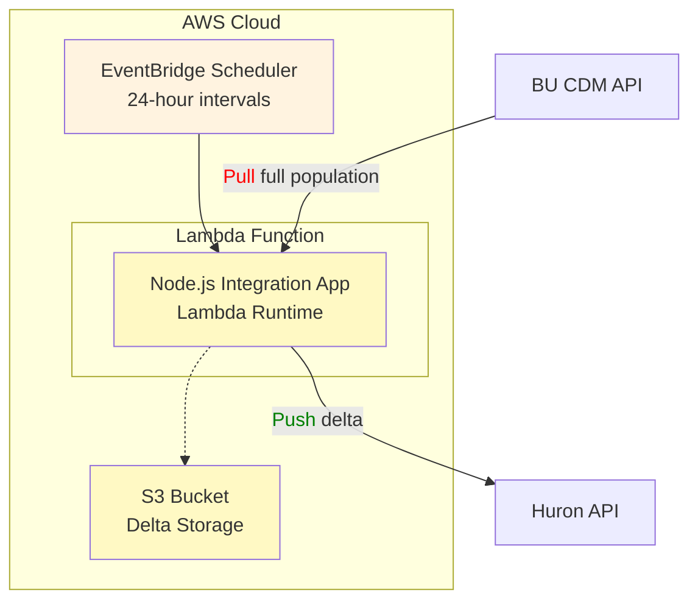
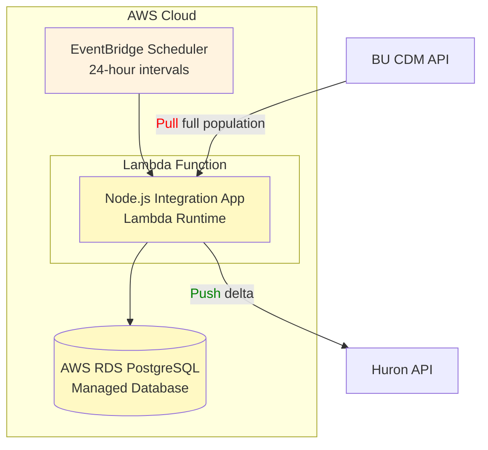
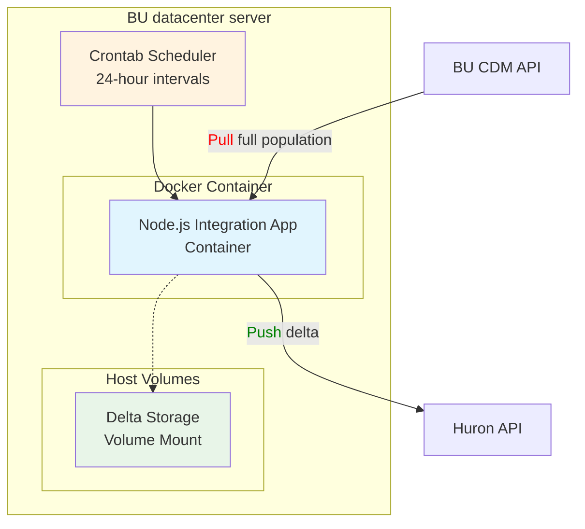
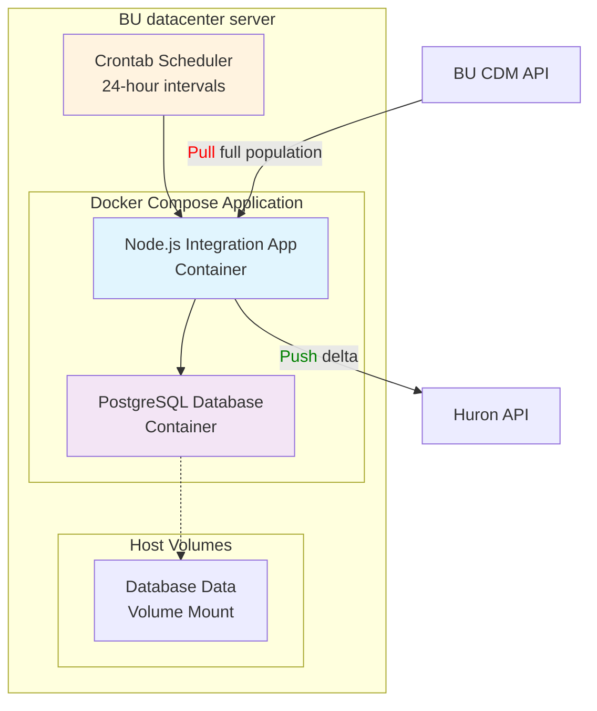
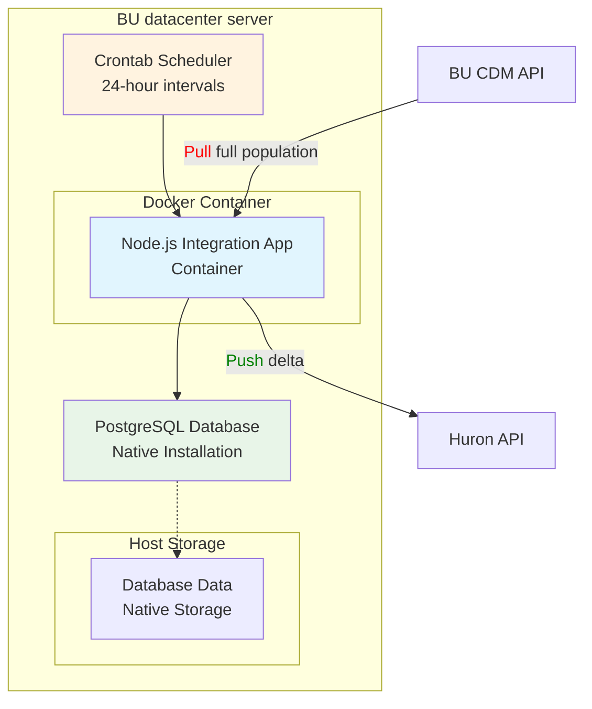
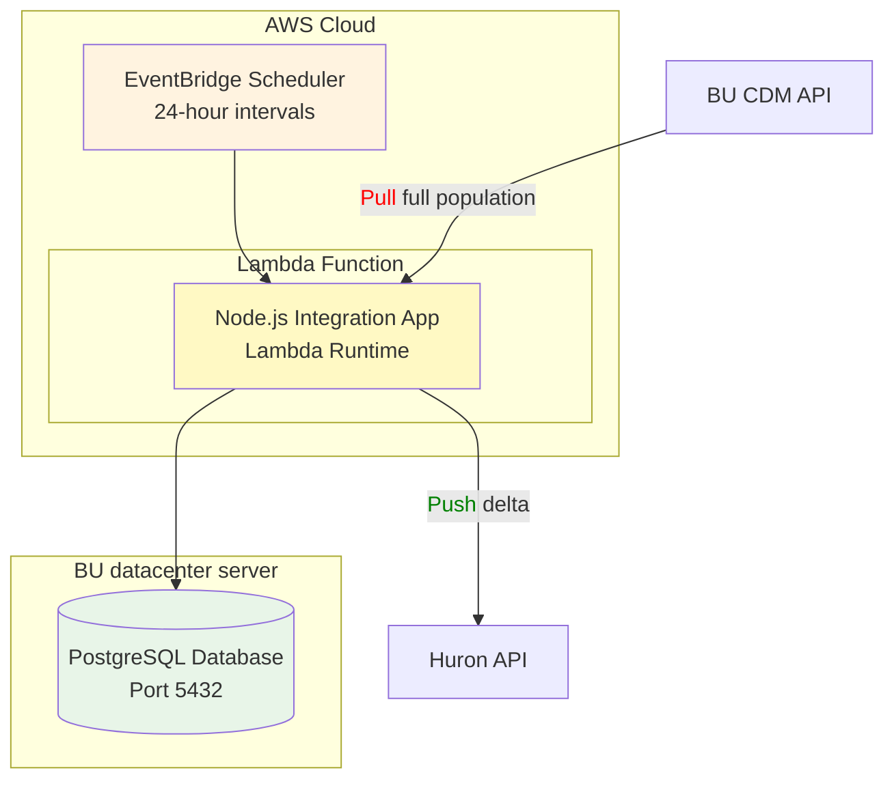
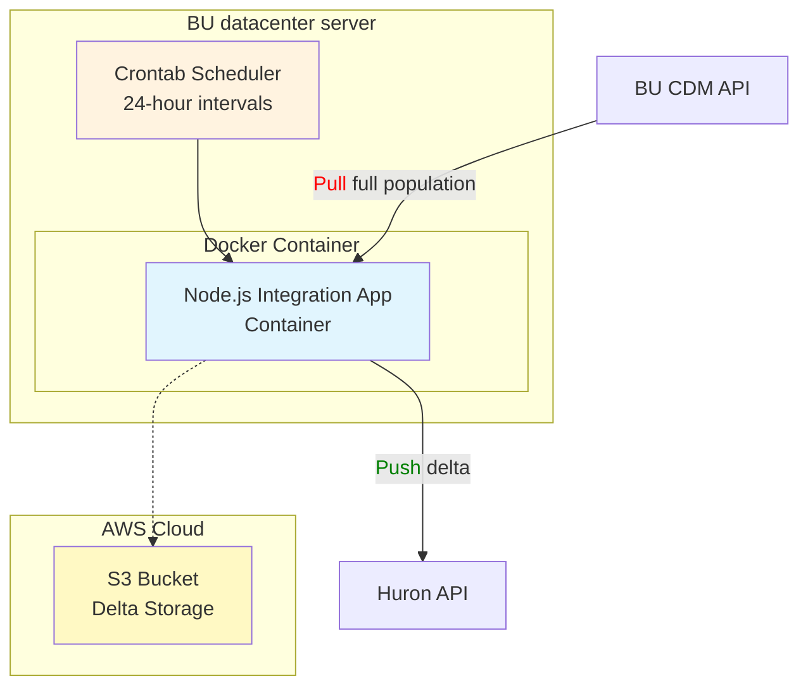
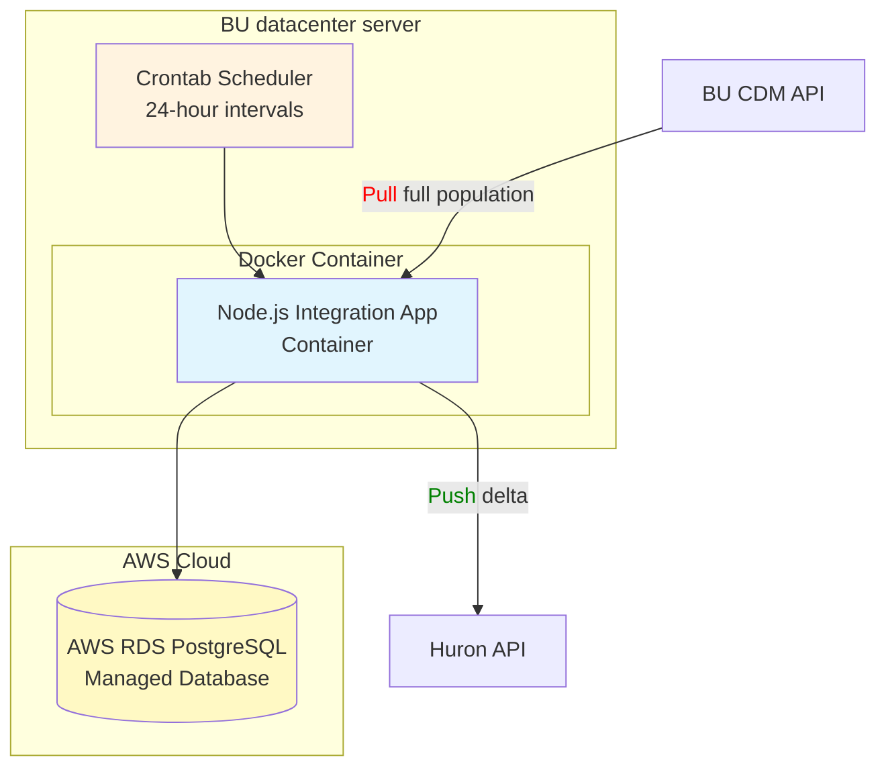

# Integration Application Deployment Options

## Summary

This document outlines deployment architecture options for the Integration application currently under development, which provides data synchronization and delta computation capabilities. The application's containerizable architecture makes the core logic portable across different deployment environments and infrastructure configurations.

The application supports both file-based and database-centric storage patterns. For many use cases where data source retrievals fall under certain size thresholds, a database is often unnecessary, making file-based approaches (for "brute force" hash comparisons) sufficient. 

Combined, these factors offer flexibility to "mix and match" deployment components - choosing where and how to run the application depending on specific operational, security, cost, and compliance considerations.

The deployment options below are organized into two categories: **Most Practical Orientations** (recommended approaches in order of precedence) and **Hybrid Deployment Options** (viable alternatives for specific use cases).

## Deployment Architecture Options

### Most Practical Orientations
*These represent the most practical deployment patterns, presented in order of recommended precedence based on operational simplicity, cost-effectiveness, and maintainability.*

#### 1. AWS Lambda with S3 File Storage
**Summary**: Serverless AWS Lambda function execution with S3-based delta storage. Delta computation performed via file system operations and "brute force" hash comparisons. Pure cloud-native file-based deployment with unlimited scalability and no database dependencies. EventBridge scheduling provides reliable execution.

#### 2. Full AWS Serverless Database Architecture
**Summary**: Complete cloud-native solution with AWS Lambda compute and AWS RDS managed database. Database handles delta computation via SQL operations. Fully managed infrastructure eliminates operational overhead while providing enterprise-grade reliability and automatic scaling.

#### 3. Full Containerized File-Based Deployment
**Summary**: Complete Docker Compose solution running on BU datacenter servers with file-based delta storage on mounted volumes. No database required - all delta computation performed via file system operations and "brute force" hash comparisons.

#### 4. Full Containerized Database Deployment
**Summary**: Complete Docker Compose solution running on BU datacenter servers with containerized PostgreSQL database. Delta computation performed via SQL joins within the database. Scheduled execution via crontab provides predictable 24-hour processing cycles.

### Hybrid Deployment Options
*While these hybrid cases combine different infrastructure components in ways that may not be as optimal from the perspective of cost/simplicity, they remain viable options should specific operational needs, compliance requirements, or infrastructure constraints necessitate their use.*

#### 1. Hybrid Containerized with Native Database
**Summary**: Docker containerized application with PostgreSQL running natively on the BU datacenter server. Database handles delta computation via SQL operations. Reduces container overhead for the database while maintaining application portability and easier backup management for critical data.

#### 2. AWS Lambda with On-Premise Database
**Summary**: Serverless AWS Lambda function execution with database remaining on BU datacenter infrastructure. Database handles delta computation via SQL operations. EventBridge scheduling eliminates server maintenance overhead while maintaining database control on-premise.

#### 3. Containerized Application with S3 File Storage
**Summary**: Docker containerized application running on BU datacenter server with S3-based delta storage. Delta computation performed via file system operations and "brute force" hash comparisons. Combines local compute control with cloud-native file storage benefits including unlimited scalability, automated backups, and managed storage infrastructure.

#### 4. Containerized Application with AWS RDS Database
**Summary**: On-premise containerized application leveraging AWS RDS for managed PostgreSQL database services. Database handles delta computation via SQL operations. Combines local compute control with cloud database reliability, automated backups, and professional database management.

## Technical Considerations

### Storage Architecture Patterns
- **Database-centric Storage** (Practical Options 2 & 4, Hybrid Options 1 & 4): Delta computation via SQL joins and queries within PostgreSQL database
- **File-based Storage** (Practical Options 1 & 3, Hybrid Options 2 & 3): Delta computation via file system operations and hash comparisons
- **Local File Storage**: Practical Option 3 with BU datacenter file systems in Docker containers
- **S3 File Storage**: Practical Option 1 and Hybrid Option 3 with cloud-native file management

### Security & Network Requirements
- **Practical Options (1-4)**: Standard cloud security (Options 1-2) or internal network security (Options 3-4)
- **Hybrid Option 1**: Standard containerized database security with native PostgreSQL
- **Hybrid Option 2**: VPN or secure network tunnel required for Lambda→Database connectivity  
- **Hybrid Option 3**: AWS IAM roles, S3 bucket policies, and container security
- **Hybrid Option 4**: AWS security groups and VPC configuration for RDS access

### Cost Implications
- **Full Cloud** (Practical Options 1-2): AWS service costs only, minimal operational overhead
- **On-premise Container** (Practical Options 3-4): Server maintenance, electricity, container orchestration costs
- **Hybrid Infrastructure** (Hybrid Options 1-4): Mix of infrastructure and cloud service costs with varying operational complexity

### Operational Complexity
- **Lowest**: Practical Options 1-2 (fully managed cloud services)
- **Low-Moderate**: Practical Options 3-4 (containerized solutions with standard patterns)
- **Moderate**: Hybrid Options 1 & 3 (mixed infrastructure requiring coordination)
- **Moderate-High**: Hybrid Options 2 & 4 (cross-network dependencies and hybrid management)