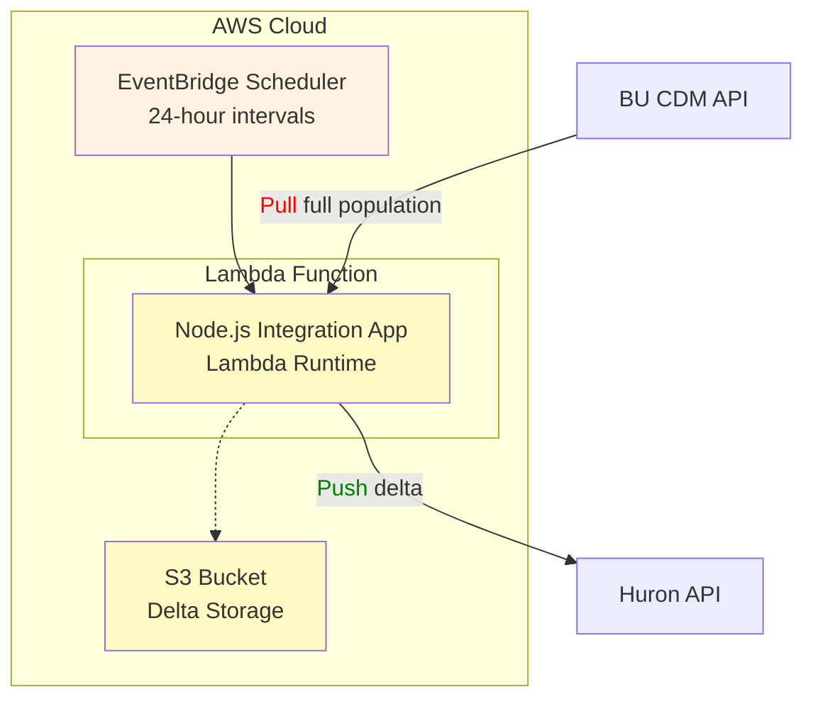
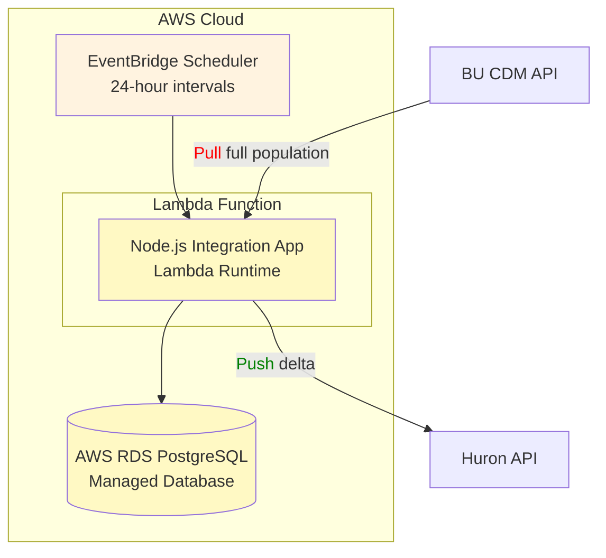
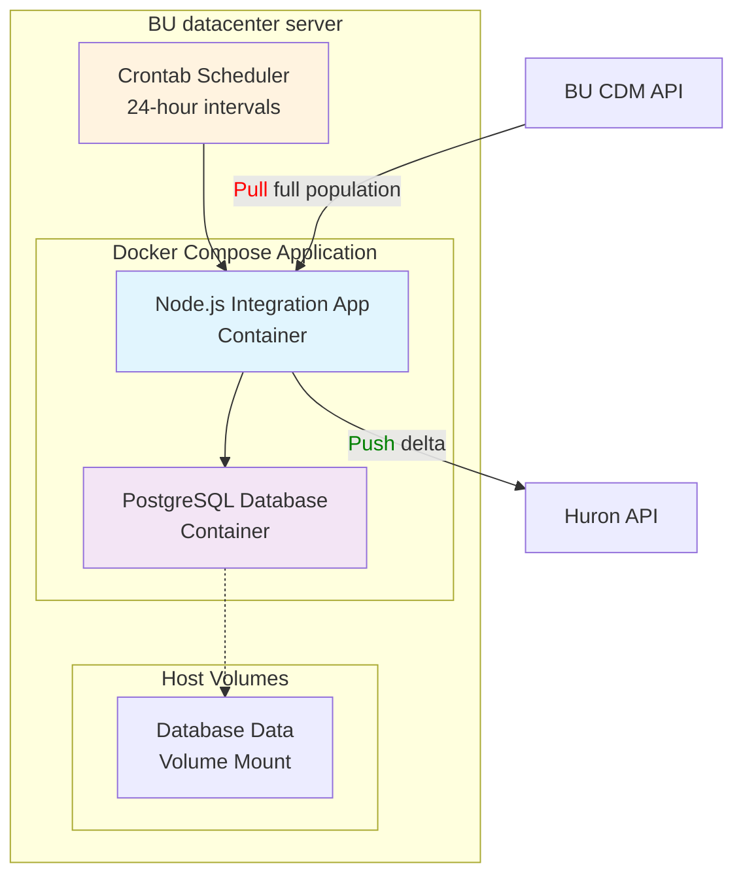
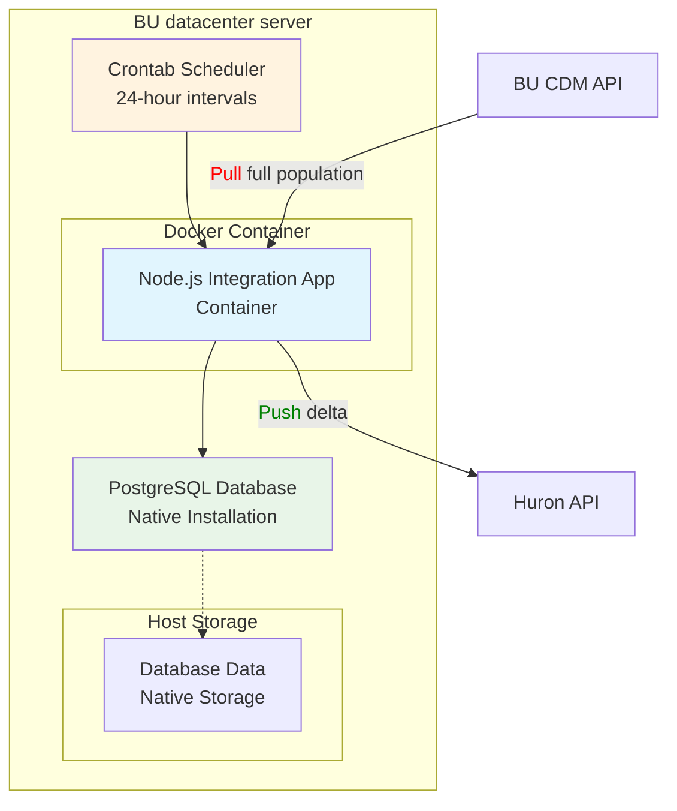
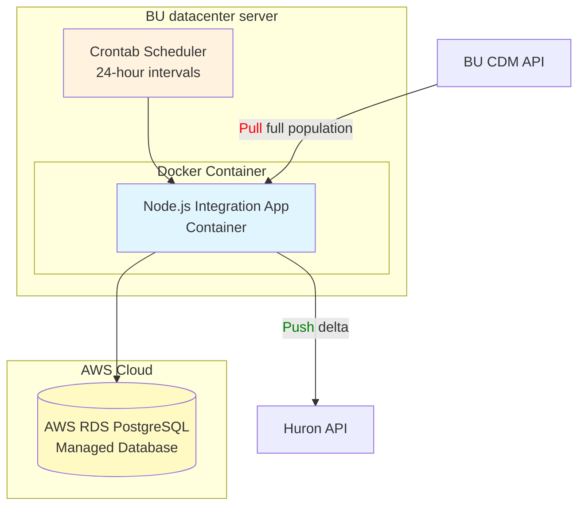
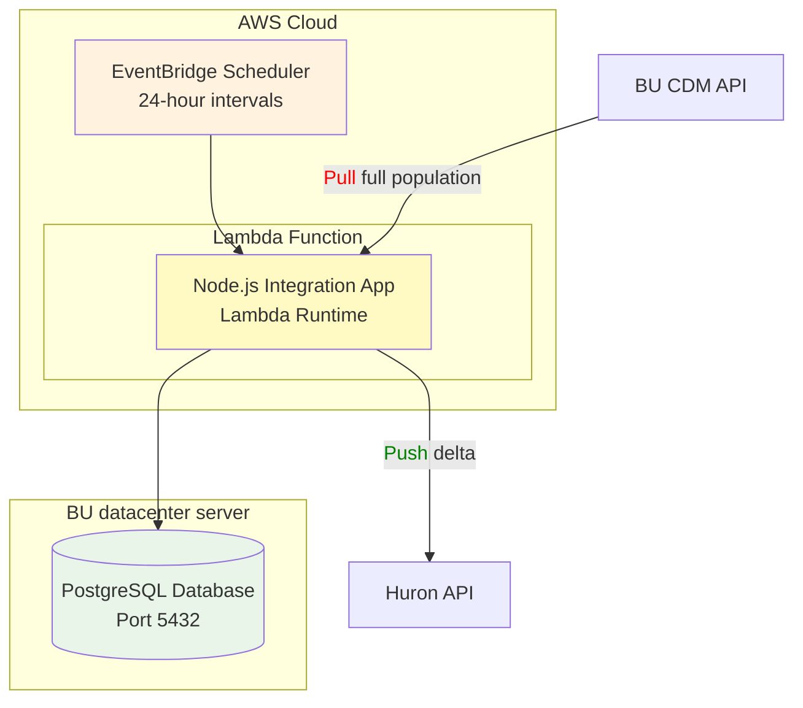
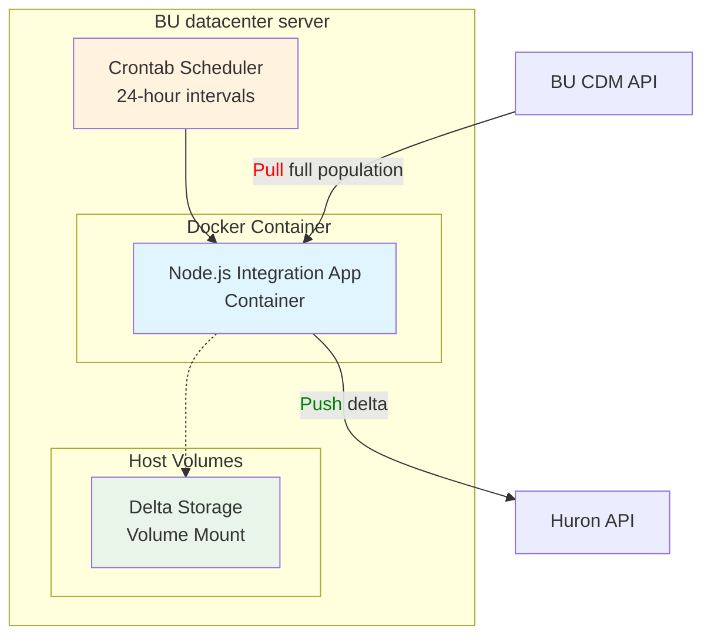
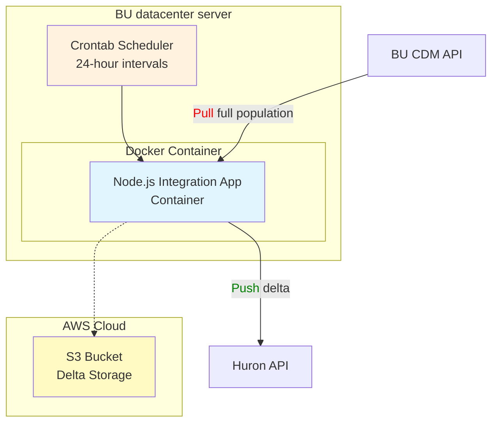

# Integration Application Deployment Options

## Summary

This document outlines deployment architecture options for the Integration application currently under development, which provides data synchronization and delta computation capabilities. The application's containerizable architecture makes the core logic portable across different deployment environments and infrastructure configurations.

The application supports both file-based and database-centric storage patterns. For many use cases where data source retrievals fall under certain size thresholds, a database is often unnecessary, making file-based approaches (for "brute force" hash comparisons) sufficient. 

Combined, these factors offer flexibility to "mix and match" deployment components - choosing where and how to run the application depending on specific operational, security, cost, and compliance considerations.
Most of the obvious permutations are listed below.

## Deployment Architecture Options

### 1. AWS Lambda with S3 File Storage
**Summary**: Serverless AWS Lambda function execution with S3-based delta storage. Delta computation performed via file system operations and "brute force" hash comparisons. Pure cloud-native file-based deployment with unlimited scalability and no database dependencies. EventBridge scheduling provides reliable execution.

```mermaid
graph TB
    subgraph "AWS Cloud"
        subgraph "Lambda Function"
            APP[Node.js Integration App<br/>Lambda Runtime]
        end
        
        S3[S3 Bucket<br/>Delta Storage]
        EB[EventBridge Scheduler<br/>24-hour intervals]
        
        APP -.-> S3
        EB --> APP
    end
    
    EXT[BU CDM API] -->|"<span style='color:red'>Pull</span> full population"| APP
    APP -->|"<span style='color:green'>Push</span> delta"| TARGET[Huron API]
    
    style APP fill:#fff9c4
    style S3 fill:#fff9c4
    style EB fill:#fff3e0
```

### 2. Full AWS Serverless Database Architecture
**Summary**: Complete cloud-native solution with AWS Lambda compute and AWS RDS managed database. Database handles delta computation via SQL operations. Fully managed infrastructure eliminates operational overhead while providing enterprise-grade reliability and automatic scaling.

```mermaid
graph TB
    subgraph "AWS Cloud"
        subgraph "Lambda Function"
            APP[Node.js Integration App<br/>Lambda Runtime]
        end
        
        RDS[(AWS RDS PostgreSQL<br/>Managed Database)]
        EB[EventBridge Scheduler<br/>24-hour intervals]
        
        APP --> RDS
        EB --> APP
    end
    
    EXT[BU CDM API] -->|"<span style='color:red'>Pull</span> full population"| APP
    APP -->|"<span style='color:green'>Push</span> delta"| TARGET[Huron API]
    
    style APP fill:#fff9c4
    style RDS fill:#fff9c4
    style EB fill:#fff3e0
```

### 3. Full Containerized Database Deployment
**Summary**: Complete Docker Compose solution running on BU datacenter servers with containerized PostgreSQL database. Delta computation performed via SQL joins within the database. Scheduled execution via crontab provides predictable 24-hour processing cycles.

```mermaid
graph TB
    subgraph "BU datacenter server"
        subgraph "Docker Compose Application"
            APP[Node.js Integration App<br/>Container]
            DB[PostgreSQL Database<br/>Container]
            APP --> DB
        end
        
        subgraph "Host Volumes"
            DBDATA[Database Data<br/>Volume Mount]
        end
        
        CRON[Crontab Scheduler<br/>24-hour intervals]
        
        DB -.-> DBDATA
        CRON --> APP
    end
    
    EXT[BU CDM API] -->|"<span style='color:red'>Pull</span> full population"| APP
    APP -->|"<span style='color:green'>Push</span> delta"| TARGET[Huron API]
    
    style APP fill:#e1f5fe
    style DB fill:#f3e5f5
    style CRON fill:#fff3e0
```

### 4. Hybrid Containerized with Native Database
**Summary**: Docker containerized application with PostgreSQL running natively on the BU datacenter server. Database handles delta computation via SQL operations. Reduces container overhead for the database while maintaining application portability and easier backup management for critical data.

```mermaid
graph TB
    subgraph "BU datacenter server"
        subgraph "Docker Container"
            APP[Node.js Integration App<br/>Container]
        end
        
        DB[PostgreSQL Database<br/>Native Installation]
        
        subgraph "Host Storage"
            DBDATA[Database Data<br/>Native Storage]
        end
        
        CRON[Crontab Scheduler<br/>24-hour intervals]
        
        APP --> DB
        DB -.-> DBDATA
        CRON --> APP
    end
    
    EXT[BU CDM API] -->|"<span style='color:red'>Pull</span> full population"| APP
    APP -->|"<span style='color:green'>Push</span> delta"| TARGET[Huron API]
    
    style APP fill:#e1f5fe
    style DB fill:#e8f5e8
    style CRON fill:#fff3e0
```

### 5. Containerized Application with AWS RDS Database
**Summary**: On-premise containerized application leveraging AWS RDS for managed PostgreSQL database services. Database handles delta computation via SQL operations. Combines local compute control with cloud database reliability, automated backups, and professional database management.

```mermaid
graph TB
    subgraph "BU datacenter server"
        subgraph "Docker Container"
            APP[Node.js Integration App<br/>Container]
        end
        
        CRON[Crontab Scheduler<br/>24-hour intervals]
        
        CRON --> APP
    end
    
    subgraph "AWS Cloud"
        RDS[(AWS RDS PostgreSQL<br/>Managed Database)]
    end
    
    APP --> RDS
    EXT[BU CDM API] -->|"<span style='color:red'>Pull</span> full population"| APP
    APP -->|"<span style='color:green'>Push</span> delta"| TARGET[Huron API]
    
    style APP fill:#e1f5fe
    style RDS fill:#fff9c4
    style CRON fill:#fff3e0
```

### 6. AWS Lambda with On-Premise Database
**Summary**: Serverless AWS Lambda function execution with database remaining on BU datacenter infrastructure. Database handles delta computation via SQL operations. EventBridge scheduling eliminates server maintenance overhead while maintaining database control on-premise.

```mermaid
graph TB
    subgraph "AWS Cloud"
        subgraph "Lambda Function"
            APP[Node.js Integration App<br/>Lambda Runtime]
        end
        
        EB[EventBridge Scheduler<br/>24-hour intervals]
        
        EB --> APP
    end
    
    subgraph "BU datacenter server"
        DB[(PostgreSQL Database<br/>Port 5432)]
    end
    
    APP --> DB
    EXT[BU CDM API] -->|"<span style='color:red'>Pull</span> full population"| APP
    APP -->|"<span style='color:green'>Push</span> delta"| TARGET[Huron API]
    
    style APP fill:#fff9c4
    style DB fill:#e8f5e8
    style EB fill:#fff3e0
```

### 7. Full Containerized File-Based Deployment
**Summary**: Complete Docker Compose solution running on BU datacenter servers with file-based delta storage on mounted volumes. No database required - all delta computation performed via file system operations and "brute force" hash comparisons.

```mermaid
graph TB
    subgraph "BU datacenter server"
        subgraph "Docker Container"
            APP[Node.js Integration App<br/>Container]
        end
        
        subgraph "Host Volumes"
            DELTA[Delta Storage<br/>Volume Mount]
        end
        
        CRON[Crontab Scheduler<br/>24-hour intervals]
        
        APP -.-> DELTA
        CRON --> APP
    end
    
    EXT[BU CDM API] -->|"<span style='color:red'>Pull</span> full population"| APP
    APP -->|"<span style='color:green'>Push</span> delta"| TARGET[Huron API]
    
    style APP fill:#e1f5fe
    style DELTA fill:#e8f5e8
    style CRON fill:#fff3e0
```

### 8. Containerized Application with S3 File Storage
**Summary**: Docker containerized application running on BU datacenter server with S3-based delta storage. Delta computation performed via file system operations and "brute force" hash comparisons. Combines local compute control with cloud-native file storage benefits including unlimited scalability, automated backups, and managed storage infrastructure.

```mermaid
graph TB
    subgraph "BU datacenter server"
        subgraph "Docker Container"
            APP[Node.js Integration App<br/>Container]
        end
        
        CRON[Crontab Scheduler<br/>24-hour intervals]
        
        CRON --> APP
    end
    
    subgraph "AWS Cloud"
        S3[S3 Bucket<br/>Delta Storage]
    end
    
    APP -.-> S3
    EXT[BU CDM API] -->|"<span style='color:red'>Pull</span> full population"| APP
    APP -->|"<span style='color:green'>Push</span> delta"| TARGET[Huron API]
    
    style APP fill:#e1f5fe
    style S3 fill:#fff9c4
    style CRON fill:#fff3e0
```

## Technical Considerations

### Storage Architecture Patterns
- **Database-centric Storage** (Options 1-5): Delta computation via SQL joins and queries within PostgreSQL database
- **File-based Storage** (Options 6-8): Delta computation via file system operations and hash comparisons
- **Local File Storage**: Option 6 with BU datacenter file systems in Docker containers
- **S3 File Storage**: Options 7-8 with cloud-native file management

### Security & Network Requirements
- **Database Options (1-3)**: Internal network security, standard firewall configurations
- **Database Option 4**: VPN or secure network tunnel required for Lambda→Database connectivity  
- **Database Option 5**: AWS security groups and VPC configuration for RDS access
- **File Option 6**: Standard file system permissions and Docker container security
- **File Options 7-8**: AWS IAM roles and S3 bucket policies

### Cost Implications
- **On-premise Database** (1-2): Server maintenance, electricity, database administration costs
- **Hybrid Database** (3-4): Mix of infrastructure and cloud service costs  
- **Full Cloud Database** (5): AWS service costs, reduced operational overhead
- **On-premise File** (6): Server maintenance, minimal storage overhead
- **Hybrid File** (7): Server maintenance plus S3 storage costs
- **Cloud File** (8): AWS Lambda and S3 costs only

### Operational Complexity
- **Lowest**: Options 5, 8 (fully managed services)
- **Low-Moderate**: Options 1, 3, 6, 7 (containerized with managed components)
- **Moderate**: Option 4 (hybrid architecture requiring network management)
- **Highest**: Option 2 (native database installation requiring manual administration)