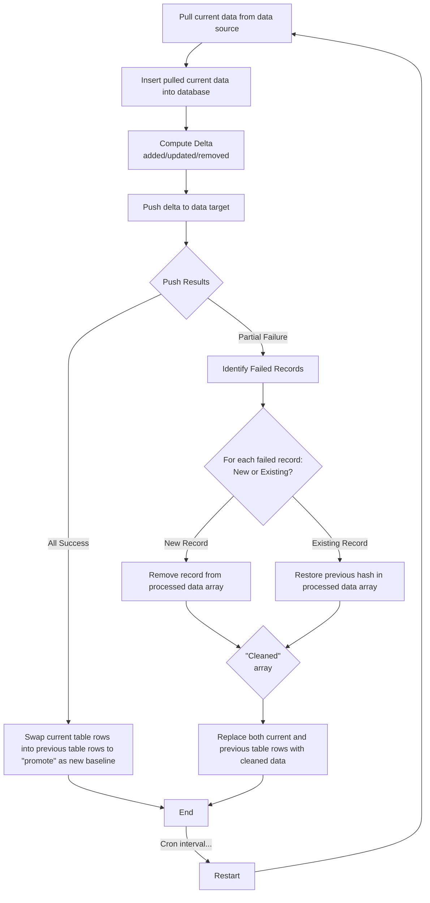
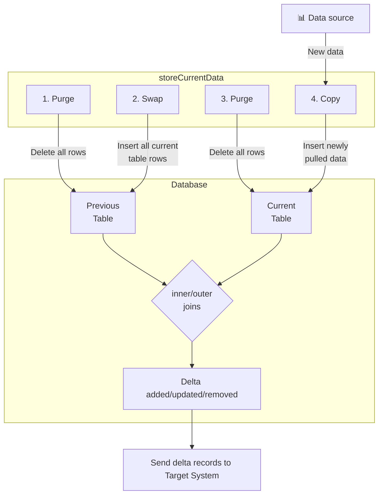
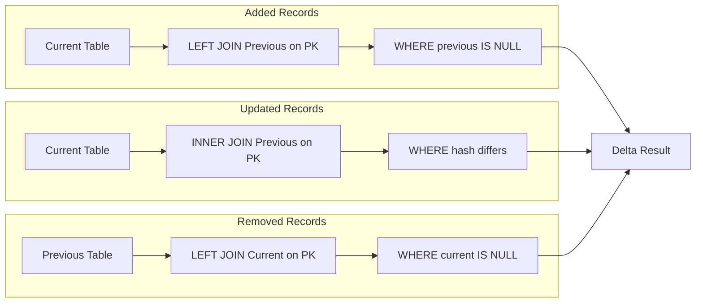

# Database Delta Storage - Visual Overview

This directory contains the database-centric implementation of delta storage using TypeORM with support for both PostgreSQL (production) and SQLite (testing).

## Architecture Overview

The database delta storage follows a different paradigm from file-based storage:

- **File-based storage**: Current data comes from live DataSource, only previous data is stored
- **Database storage**: Both current and previous data are stored, deltas computed via SQL operations

## Comprehensive Delta Workflow

This flowchart illustrates the complete delta processing workflow: data is pulled from the source, stored in the database, deltas are computed and pushed to the target system. Based on push results, the system either promotes current data to become the new baseline (all success) or replaces both tables with cleaned data after removing failed records (partial failure).

## Delta Computation

This diagram expands on the "Store" step from the beginning of the Comprehensive Delta Workflow above, showing the detailed 4-step process of how current data is stored and rotated in the database and how deltas are computed using SQL joins between the Previous and Current tables.

## SQL Delta Computation

This diagram details the SQL join operations from the "Join" step in the Delta Computation diagram above, showing the specific LEFT JOIN and INNER JOIN queries used to identify added, updated, and removed records by comparing primary keys and hash values between tables.

