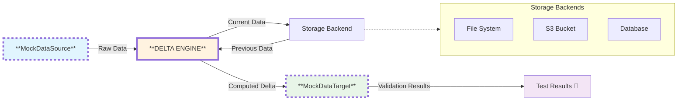

# Mocked trial running

## Overview

This test harness puts the delta computation capabilities of the integration library through comprehensive trial runs by creating a controlled testing environment. The system "sandwiches" the core delta computation logic between simulated components: a **mocked data source** that generates test datasets on one side, and a **mocked data target** that validates the computed deltas on the other side.

This approach allows us to verify that the delta computation algorithms work correctly across different storage backends (file system, S3, database) and various data scenarios without requiring real external systems for the source and target components.


```mermaid
flowchart LR
    A[**MockDataSource**] -->|Raw Data| B[**DELTA ENGINE**]
    B -->|Current Data| C[Storage Backend]
    C -->|Previous Data| B
    B -->|Computed Delta| D[**MockDataTarget**]
    D -->|Validation Results| E[Test Results 👤]
    
    subgraph Storage ["Storage Backends"]
        F[File System]
        G[S3 Bucket] 
        H[Database]
    end
    
    C -.-> Storage
    
    style A fill:#e1f5fe,stroke-dasharray: 5 5,stroke-width:4px
    style D fill:#e8f5e8,stroke-dasharray: 5 5,stroke-width:4px
    style B fill:#fff3e0,stroke-width:4px
    style E fill:#f3e5f5
```

## Steps

1. **Configure the test scenario:**
   - All configuration for the test harness is derived from `RunnerParams.json` in the `test/test-harness` directory.
   - To select which scenario to run, set the `activeParameterSetId` property in `RunnerParams.json` to the ID of the desired parameter set.
   - Adjust the properties of the matching `parameterSet` from their sample values to the actual values you want to test. This allows you to customize the data source, target, and storage backend for each run.

2. **Run the test harness:**
   - Use the npm script:
     ```bash
     npm run run-harness
     ```
   - The harness will execute using the configuration from `RunnerParams.json` and output results for review.

## Storage Backends

The following content details how to run the test harness for the three different storage backend types: File system, S3 bucket, and Database. The number of items output by the source data mock is controlled by the `populationSize` property in the applicable parameter set. The `clientId` property also applies to all scenarios and determines the logical identity of the test client.

When you run the test harness, a directory will automatically be created if it does not already exist: `${workspace}/test/test−harness/storage/{clientId}/`

- **File system**
  - The output of the DataSource mock is stored in a subdirectory named after the `clientId` specified in `RunnerParams.json`.
  - To use the file system backend, set `activeParameterSetId` to `1` in `RunnerParams.json` to select the file system scenario.

    ```mermaid
    flowchart LR
        A[**MockDataSource**] -->|Raw Data| B[**DELTA ENGINE**]
        B -->|Current Data| C[File System]
        C -->|Previous Data| B
        B -->|Computed Delta| D[**MockDataTarget**]
        D -->|Validation Results| E[Test Results 👤]
        style A fill:#e1f5fe,stroke-dasharray: 5 5,stroke-width:4px
        style D fill:#e8f5e8,stroke-dasharray: 5 5,stroke-width:4px
        style B fill:#fff3e0,stroke-width:4px
        style E fill:#f3e5f5
    ```

- **S3 bucket**

- **Database**

