# Mocked trial running

## Overview

This test harness puts the delta computation capabilities of the integration library through comprehensive trial runs by creating a controlled testing environment. The system "sandwiches" the core delta computation logic between simulated components: a **mocked data source** that generates test datasets on one side, and a **mocked data target** that validates the computed deltas on the other side.

This approach allows us to verify that the delta computation algorithms work correctly across different storage backends (file system, S3, database) and various data scenarios without requiring real external systems for the source and target components.


## Basic Steps

1. **Configure the test scenario:**
   - All configuration for the test harness is derived from `RunnerConfig.json` in the `test/test-harness` directory.
   - To select which scenario to run, set the `activeParameterSetId` property in `RunnerConfig.json` to the ID of the desired parameter set.
   - Adjust the properties of the matching `parameterSet` from their sample values to the actual values you want to test. This allows you to customize the data source, target, and storage backend for each run.

2. **Run the test harness:**
   - Use the npm script:
     ```bash
     npm run run-harness
     ```
   - The harness will execute using the configuration from `RunnerConfig.json` and output results for review.

## Mock data source


The mock data source first attempts to load data from a cache file (typically located in a client-specific subdirectory under the storage path). If the cache file exists, it is loaded and used for the test run. If the cache file does not exist, the mock data source generates a new set of random data records using the `RandomData` generator. This newly generated data is then saved to the cache file for future runs.

Random data generation simulates person data and includes creating realistic values for fields such as names, dates, email addresses, roles, and interests. The generator uses a variety of strategies to ensure diversity and realism, such as weighted random selection for boolean fields, random date ranges, and shuffling for multiselect fields. The number of records generated is controlled by the `populationSize` property set in `RunnerConfig.json`.

This approach ensures repeatability for test runs (when the cache exists) and variability for new scenarios (when the cache is missing or cleared). For more details, see the implementation in `mock/MockDataSource.ts` and `mock/RandomData.ts`.

```mermaid
flowchart TD
  subgraph DataSourceLogic ["Mock Data Source Logic"]
    A[Check for cache file 📁] -->|Exists| B[Load cached data]
    A -- Does not exist --> C[Generate random data]
    C --> D[Save to cache 📁]
    C --> B
  end
  B --> E[Provide data to test harness]
  style A fill:#e1f5fe,stroke-width:2px
  style B fill:#fff3e0,stroke-width:2px
  style C fill:#e8f5e8,stroke-width:2px
  style D fill:#e1f5fe,stroke-width:2px
  style E fill:#f3e5f5,stroke-width:2px
```



## Mock data target

The mock data target simply writes out to the console those items that are "pushed" to it.

However, you can simulate push failures by using the `simulatedPushFailureIndexes` array property of the parameter set you select in `RunnerConfig.json`.
Parameter set with id `5` is a an example of this, and you should see corresponding push failure notifications in the console output for items `5, 10, 15, 20`.

If you include `simulatedPushFailureIndexes`, you should also see that the corresponding hash values in delta storage (e.g., a file, S3 object, or database table depending on the scenario) remain as they were. This is because, after a simulated push failure, the system restores the hash values for those failed records in delta storage. The restoration process matches the failed record's primary key to the previous baseline and resets its hash to the original value, ensuring that these items are detected as unchanged in subsequent runs. This mechanism prevents failed pushes from being incorrectly marked as processed and maintains accurate change detection for future delta computations.


## Storage Backend Scenarios

The following content details how to run the test harness for the three different storage backend types: File system, S3 bucket, and Database. The number of items output by the source data mock is controlled by the `populationSize` property in the applicable parameter set. The `clientId` property also applies to all scenarios and determines the logical identity of the test client.

When you run the test harness, a file will automatically be created if it does not already exist: `${workspace}/test/test−harness/storage/{clientId}/data-source.json`
This file represents mocked data source output.

**SEQUENCE (All Backends)**

1. `npm run test-harness`
2. **Inspect console output:** 
  The first time running the test harness for `clientId`, you will see console output that shows an attempt to send EVERY item issued by the mock data source to the mock data target. This can be regarded as an initial load to the target.
3. **Simulate changes:**
  Open the mock data source cached file: `${workspace}/test/test−harness/storage/{clientId}/data-source.json`.
  Make random edits to simulate changes that would occur over the course of time.
4. `npm run test-harness`
5. **Inspect console output:**
  What you should see in the console output is the mock data target reporting what is being "pushed" to it.
  The "pushed" content should comprise only those items that the delta engine determined had changed when processing occurs against the changes you made in step 3 above.
  The primary key is a composite key of `dob` and `emailAddress`, so the console output should reflect the following:
  - If you add a new entry, this will simulate the addition of a new person to the source system.
  - If you remove an entry, this will simulate a person being removed from the source system.
  - Changes to any of the following fields will simulate an update to the corresponding person in the source system:
    `firstName, middleInitial, lastName, deactivated, memberSince, website, role, hobbies`.
  - Changes to `dob` and/or `emailAddress` of existing items will simulate both a removal of the existing person and the addition of a new person.

**SEQUENCE VARIATIONS:**

- **File system**
  
  - To use the file system backend, set `activeParameterSetId` to `1` or `5` in `RunnerConfig.json` to select the file system scenario.
  - Run the main sequence steps 1-5 above.
  - If you set `activeParameterSetId` to `5` in `RunnerConfig.json`, there should be some simulated "push" failures to the data target.
    Check `${workspace}/test/test−harness/storage/{clientId}/previous-input.json` for the hashes of items that correspond to the failed items and verify that they have not changed.
  
  
  ```mermaid
  flowchart TD
      A[MockDataSource] -->|Raw Data| B[Delta Engine]
      B -->|Current Data| C[File System]
      C -->|Previous Data| B
      B -->|Computed Delta &quot;push&quot;| D[MockDataTarget]
      D -->|&quot;push&quot; console output| E[Inspect 👤 <br>console output]
      style A fill:#f5f5f5,stroke:#d0d0d0,color:#888888
      style B fill:#f5f5f5,stroke:#d0d0d0,color:#888888
      style C fill:#ff6b35,stroke:#000000,stroke-width:3px,color:#ffffff
      style D fill:#f5f5f5,stroke:#d0d0d0,color:#888888
      style E fill:#f5f5f5,stroke:#d0d0d0,color:#888888
  ```
  
- **S3 bucket**

  - To use the S3 bucket backend, set `activeParameterSetId` to `6` or `7` in `RunnerConfig.json` to select the S3 scenario.
  - Adjust the `config.bucketName` value to that of a bucket that exists and you can read and write to.
    Adjust the `config.region` to match the region of the bucket.
  - Run the main sequence steps 1-5 above.
  - If you set `activeParameterSetId` to `7`, there should be some simulated "push" failures to the data target.
    Check the S3 bucket for the object whose key prefix matches `test/test-harness/storage/{clientId}/previous-input.json` and verify that the hashes of items corresponding to failed pushes have not changed.

  ```mermaid
  flowchart TD
      A[MockDataSource] -->|Raw Data| B[Delta Engine]
      B -->|Current Data| C[S3 Bucket]
      C -->|Previous Data| B
      B -->|Computed Delta &quot;push&quot;| D[MockDataTarget]
      D -->|&quot;push&quot; console output| E[Inspect 👤 <br>console output]
      style A fill:#f5f5f5,stroke:#d0d0d0,color:#888888
      style B fill:#f5f5f5,stroke:#d0d0d0,color:#888888
      style C fill:#ff6b35,stroke:#000000,stroke-width:3px,color:#ffffff
      style D fill:#f5f5f5,stroke:#d0d0d0,color:#888888
      style E fill:#f5f5f5,stroke:#d0d0d0,color:#888888
  ```

- **Database**

  - To use the database backend with persistent SQLite storage, set `activeParameterSetId` to `3` in `RunnerConfig.json` to select the file-based SQLite database scenario. This scenario uses a SQLite database file (specified by `config.filename`) for persistent storage of delta data between test runs. Unlike in-memory databases, this allows the delta state to be maintained across multiple executions, enabling testing of incremental changes and data persistence. The database file is created if it doesn't exist, and synchronization is enabled to automatically create or update the schema as needed.
  - Run the main sequence steps 1-5 above.
  - If you set `activeParameterSetId` to `3`, there should be some simulated "push" failures to the data target. Check the SQLite database file (e.g., `./test-db.sqlite`) for the table containing hashes of items that correspond to the failed items and verify that they have not changed.

  ```mermaid
  flowchart TD
      A[MockDataSource] -->|Raw Data| B[Delta Engine]
      B -->|Current Data| C[SQLite Database]
      C -->|Previous Data| B
      B -->|Computed Delta &quot;push&quot;| D[MockDataTarget]
      D -->|&quot;push&quot; console output| E[Inspect 👤 <br>console output]
      style A fill:#f5f5f5,stroke:#d0d0d0,color:#888888
      style B fill:#f5f5f5,stroke:#d0d0d0,color:#888888
      style C fill:#ff6b35,stroke:#000000,stroke-width:3px,color:#ffffff
      style D fill:#f5f5f5,stroke:#d0d0d0,color:#888888
      style E fill:#f5f5f5,stroke:#d0d0d0,color:#888888
  ```

